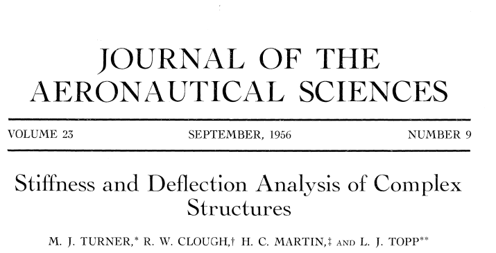

<h1> Capítulo 1: A jornada do programa </h1>

 O Método dos Elementos Finitos (MEF) é uma ferramenta numérica bastante consagrada na área de ciências exatas. Tal procedimento foi inicialmente desenvolvido com intuito de solucionar equações diferenciais que representavam determinados fenômenos na indústria aeroespacial, especialmente os problemas que envolviam mecânica dos sólidos. Segundo Vaz [1] o MEF seria uma evolução do Método dos Deslocamentos (MD) costumeiramente lecionado em disciplinas como a de teoria das estruturas ou análise de estruturas em cursos de graduação.  
   
<table>
<tr>
<td>Na Engenharia Civil o MEF é utilizado para diversos fins, desde problemas estáticos até problemas que envolvem fluídos. Tal método teve seu nome cunhado entre 1950 e 1960 e um dos principais artigos sobre a técnica foi escrito em 1956 e trata-se do texto de <a  href="https://arc.aiaa.org/doi/abs/10.2514/8.3664?journalcode=jans&"> Turner <i>et. al - Stiffness and Deflection Analysis of Complex Structures</i> [2]</a>. Porém <a href="https://onlinelibrary.wiley.com/doi/abs/10.1002/nme.962"> R. W. Clough [3]</a> um dos autores do método afirma que quando se fala em Método dos Elementos Finitos quatro nomes devem ser lembrados: (a) John H. Argyris; (b) Ray W. Clough; (c) M. J. Turner; e (d) O. C. Zienkeiwicz. Apesar da forma atual como conhecemos atualmente só na primeira metade do século XX é válido ressaltar que o método começou a ser utilizado ainda no século XVIII, através de formulações mais primitivas.</td>
<td></td>  
</tr>
</table>  
 
Avançando um pouco no tempo, o MEF veio sendo cada vez mais estudado, desenvolvido e aplicado em áreas e situações bem complexas que exigem uma maior versatilidade e agilidade na hora de sua abordagem. Desta forma, o método teve versões desenvolvidas para programas computacionais com interfaces gráficas de forma a facilitar seu emprego. São exemplos de <i>softwares</i> que tem como base o MEF: (a) ANSYS; (b) ABAQUS; (c) SAP 2000; e (d) DIANA.  
 

<h2> 1.1: O MEF na análise estrutural </h2>
Segundo Soriano (2003), existem dois tipos de modelagem que são aplicados na análise estrutural, a experimental, onde são feitos protótipos e modelos fabricados em escalas reduzidas, e a física-matemática, com a aplicação de equações representando situações reais.
A modelagem experimental é comumente utilizada em obras de grande porte que exigem análises mais complexas, como por exemplo a análise de cargas de vento em edifícios, onde uma maquete é feita e submetida a túneis de vento de maneira a verificar o comportamento da estrutura em condições limites.
Enquanto na modelagem física-matemática, caso do MEF e de vários outros métodos numéricos, seria segundo Reddy (2006, p.2) um conjunto de equações onde se busca, através de variáveis, definir e expressar as características de um sistema físico.

